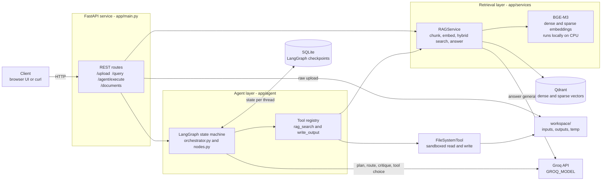
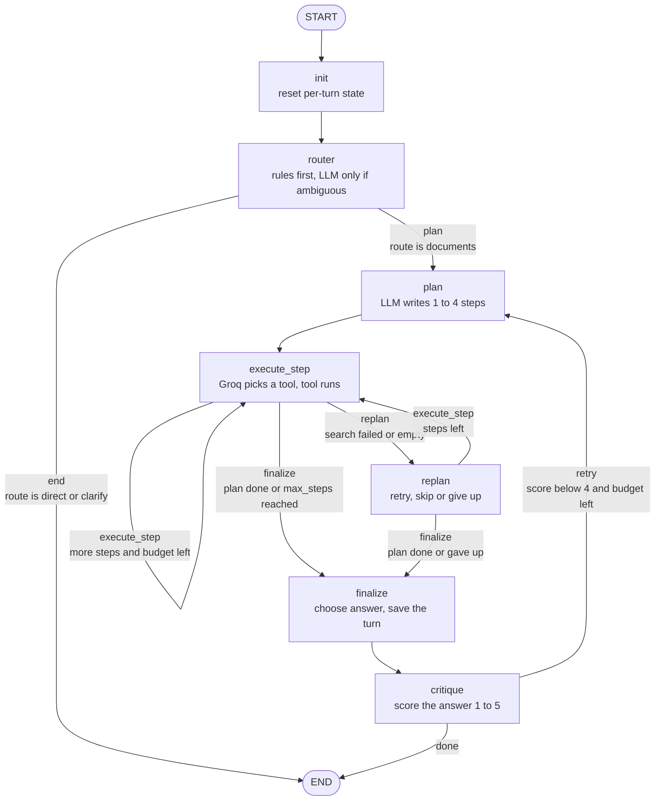
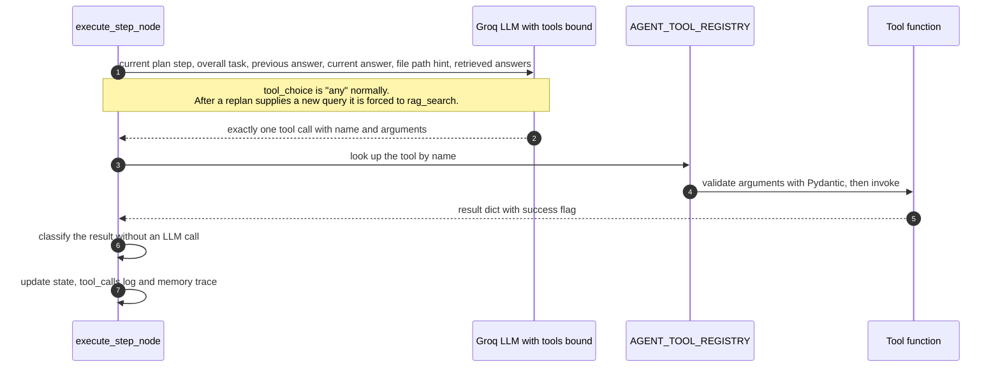
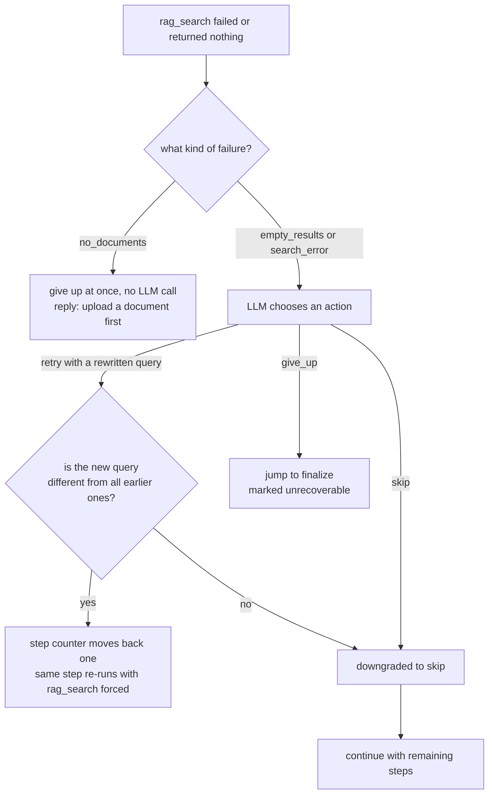
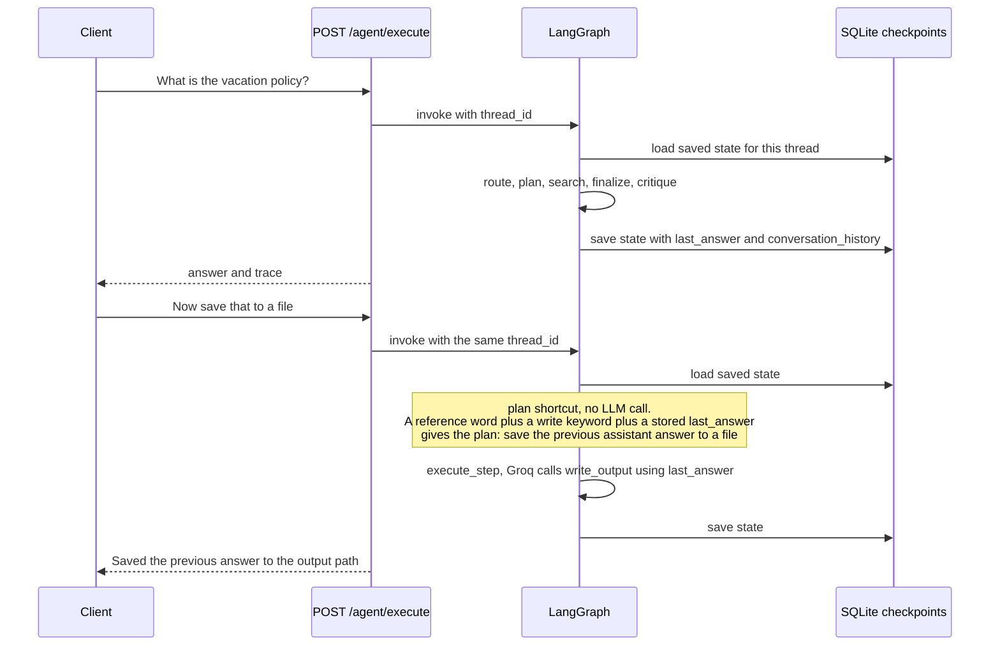
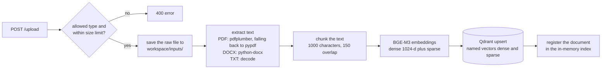
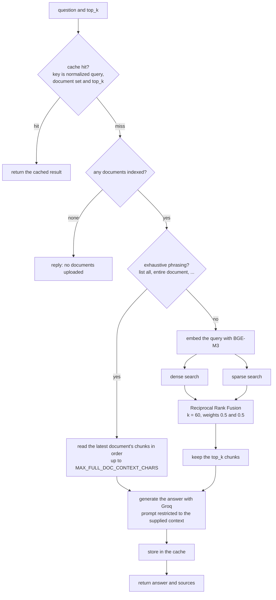

# Sovereign Agentic AI

A document-intelligence agent. Upload PDFs, Word files or text files, then ask questions in plain language. A [LangGraph](https://langchain-ai.github.io/langgraph/) agent routes each request, plans it, chooses its own tools through native function calling, recovers when a search comes back empty, and reviews its own answer before replying. Every step it takes is returned by the API, so you can see exactly how an answer was produced.

> **Where your data goes.** Embeddings (BGE-M3), vector storage (Qdrant) and uploaded files all stay on your machine. The language model is the exception: planning, routing and answer generation call the **Groq API**, so questions and the retrieved passages sent as context leave your machine. See [Known issues](#known-issues).

---

## Contents

1. [What it does](#what-it-does)
2. [System architecture](#system-architecture)
3. [The agent graph](#the-agent-graph)
4. [How a plan step runs: native tool calling](#how-a-plan-step-runs-native-tool-calling)
5. [Recovery and reflection](#recovery-and-reflection)
6. [Conversation memory](#conversation-memory)
7. [RAG pipeline](#rag-pipeline)
8. [Repository layout](#repository-layout)
9. [Getting started](#getting-started)
10. [Configuration](#configuration)
11. [API reference](#api-reference)
12. [Agent state reference](#agent-state-reference)
13. [Safety and sandboxing](#safety-and-sandboxing)
14. [Testing](#testing)
15. [Known issues](#known-issues)
16. [Ideas for next steps](#ideas-for-next-steps)

---

## What it does

| Capability | How it works |
|---|---|
| **Hybrid retrieval** | BGE-M3 produces a dense and a sparse vector per chunk. Both are searched in Qdrant and merged with Reciprocal Rank Fusion. |
| **Request routing** | Greetings and thanks are answered instantly. Vague messages get one clarifying question. Real document questions go on to planning. Regex rules decide the obvious cases, and the LLM only sees ambiguous ones. |
| **Planning** | One LLM call turns the request into 1 to 4 short steps. |
| **Native function calling** | For each step, Groq is given the real tool schemas (`rag_search`, `write_output`) and picks the tool and its arguments. No keyword matching on step text. |
| **Adaptive replanning** | If a search fails or finds nothing, the agent rewrites the query and retries, skips the step, or gives up honestly. "No documents uploaded" is detected without an LLM call. |
| **Self-critique** | After answering, a reviewer scores the answer from 1 to 5. A low score sends the agent back to plan again, with the feedback attached. |
| **Conversation memory** | LangGraph checkpoints are stored in SQLite. A follow-up such as "save that to a file" resolves against the previous answer. |
| **Whole-document answers** | Queries like "list all the questions" bypass top-k search and read the document in order, up to a size cap. |
| **Query cache** | An in-memory LRU cache returns repeated questions without re-embedding, re-searching or calling the LLM. |
| **Sandboxed file output** | The agent can only read and write inside `workspace/`, restricted by file extension and size. |

---

## System architecture



**Layers**

| Layer | Files | Responsibility |
|---|---|---|
| API | `app/main.py`, `app/models.py` | HTTP endpoints, request validation, CORS |
| Agent | `app/agent/*` | The graph, node logic, shared state, tool schemas |
| Tools | `app/tools/*` | Thin wrappers the agent calls: RAG search and sandboxed file access |
| Services | `app/services/rag_service.py` | Chunking, embedding, Qdrant access, hybrid search, answer generation, cache |
| Utilities | `app/utils/*` | Text extraction (PDF, DOCX, TXT) and chunking |

---

## The agent graph

This is the graph built in `app/agent/orchestrator.py`. Solid boxes are nodes. Labels on arrows are the strings returned by the router functions (`route_after_router`, `route_after_execute`, `should_continue`, `should_reflect`).



### Nodes

| Node | Type | What it does |
|---|---|---|
| `init` | code | Runs once per request. Resets every per-turn field (plan, results, counters) but keeps `conversation_history`, `last_answer` and the thread id. Increments `turn_count`. |
| `router` | rules, then LLM | Regexes handle greetings, thanks and farewells (reply is `direct`) and anything mentioning documents, files, saving and similar (`documents`). Only ambiguous messages reach the LLM. Guards stop the LLM from calling a long message "vague". `direct` and `clarify` replies skip planning entirely. |
| `plan` | LLM, or shortcut | Produces `{"steps": [...]}`. A request like "save that" with a previous answer on file skips the LLM and plans one write step. If planning fails, it falls back to a single search step. Also extracts a requested filename such as `summary.md` into `file_path`. |
| `execute_step` | LLM tool call | Runs exactly one plan step. See the next section. |
| `replan` | LLM, or shortcut | Runs after a failed or empty search. Decides `retry` with a new query, `skip`, or `give_up`. |
| `finalize` | code | Picks the answer (the latest retrieval that actually found something, otherwise an honest "could not find" message) and appends the turn to `conversation_history`. |
| `critique` | LLM | Scores the answer against the task. Below 4, with budget left, it clears the answer and sends the graph back to `plan`. |

### Routers

| Function | Reads | Returns |
|---|---|---|
| `route_after_router` | `route` | `plan` for `documents`, otherwise `end` |
| `route_after_execute` | `needs_replan`, then `should_continue` | `replan`, `execute_step` or `finalize` |
| `should_continue` | `current_step`, `plan`, `iteration`, `max_steps` | `execute_step` or `finalize` |
| `should_reflect` | `needs_retry` | `retry` or `done` |

Routers only read state. All state changes happen inside nodes.

### Budgets that keep loops finite

| Limit | Default | Scope |
|---|---|---|
| `max_steps` | 6 | Total `execute_step` runs in one request, shared across replans and critique retries |
| `max_replans` | 2 | Recoveries per planning attempt |
| `max_critiques` | 2 | Plan-again cycles triggered by the reviewer |

All three can be set per request. Setting `max_replans` or `max_critiques` to `0` turns that feature off.

---

## How a plan step runs: native tool calling

`execute_step_node` does not inspect the step text for words like "save". It hands the step to Groq together with the real tool schemas and lets the model choose.



**Tools exposed to the model** (`app/agent/tools.py`)

| Tool | Arguments | Behaviour |
|---|---|---|
| `rag_search` | `query` (required), `top_k` (1 to 20, default 6) | Hybrid search over indexed documents, returns a generated answer plus sources |
| `write_output` | `path` (workspace-relative), `content` | Writes a file inside the sandbox, overwriting if it exists |

**Rules enforced in code**

- The model must return exactly one tool call. Zero calls or more than one is recorded as an error. The executor never falls back to keyword routing.
- Arguments are validated by the tool's Pydantic schema before anything runs.
- Large `write_output` payloads are stored in the trace as a short preview and a character count, not in full.
- After a `rag_search`, a deterministic check decides whether the result is a failure (`search_error`), an empty retrieval (`empty_results`) or "no documents" (`no_documents`).

---

## Recovery and reflection

### When a search fails



If the recovery call itself fails, the agent defaults to `skip`, so a broken recovery step never stops a run.

### When the answer looks weak

After `finalize`, the `critique` node asks the LLM for `{"score": 1-5, "sufficient": true|false, "feedback": "..."}`.

- A score of 4 or higher with `sufficient: true` ends the run.
- Otherwise, if `critique_count < max_critiques` and `iteration < max_steps`, the answer is cleared, the replan budget is reset, and the graph returns to `plan` with the feedback included in the planning prompt.
- If the critique output cannot be parsed, the answer is accepted rather than blocking the user.
- If recovery already gave up (`unrecoverable`), critique is skipped. Scoring an honest "nothing found" reply would only waste retries.

---

## Conversation memory

State is checkpointed by LangGraph into SQLite (`SqliteSaver`, WAL mode) under a `thread_id`. Each request starts at `init`, which resets the work-in-progress fields and keeps the conversation fields.



| Field | Purpose |
|---|---|
| `conversation_history` | Recent user and assistant messages, capped at 12 messages and 8000 characters. Fed into the router and planner prompts. |
| `last_answer` | The most recent substantive answer. Not overwritten by "Saved to ..." confirmations. |
| `last_file_path` | The last file the agent wrote. |
| `turn_count` | Number of requests handled on this thread. |

---

## RAG pipeline

### Ingestion: `POST /upload`



- Each chunk's embedded text is prefixed with its file name, so a query that names a document matches it.
- Qdrant payload per chunk: `content`, `original_content`, `file_name`, `document_id`, `chunk_index`, `total_chunks`, `uploaded_at`.
- On startup the service rebuilds its in-memory document list from Qdrant, so a restart does not make indexed documents look "not uploaded".

### Query: `RAGService.query`



Each of the two searches fetches `max(10, top_k * 2)` candidates before fusion. The cache is an LRU of `RAG_CACHE_MAX_ENTRIES` items. Including the document-set signature in the key means uploads and deletions stop old entries from matching.

---

## Repository layout

```text
backend/
├── app/
│   ├── main.py                 FastAPI app and routes
│   ├── config.py               Settings read from environment variables
│   ├── models.py               Pydantic request and response models
│   │
│   ├── agent/
│   │   ├── orchestrator.py     Builds the LangGraph graph, SQLite checkpointer, run_agent()
│   │   ├── nodes.py            All nodes, routers, prompts and parsers
│   │   ├── state.py            AgentState (TypedDict)
│   │   └── tools.py            Tool functions, Pydantic schemas, StructuredTools, registry
│   │
│   ├── services/
│   │   └── rag_service.py      Embeddings, Qdrant, hybrid search, answer generation, cache
│   │
│   ├── tools/
│   │   ├── rag_tool.py         Agent-facing wrapper around RAGService
│   │   ├── file_tools.py       Sandboxed FileSystemTool
│   │   ├── ocr_tool.py         Unfinished draft, not wired in
│   │   └── code_executor.py    Empty placeholder
│   │
│   └── utils/
│       ├── file_handlers.py    PDF, DOCX and TXT text extraction
│       └── chunking.py         Recursive character chunking
│
├── workspace/                  Created on first run
│   ├── inputs/                 Raw uploaded files
│   ├── outputs/                Files the agent writes
│   └── temp/
│
├── tests/                      HTTP, memory, performance and network tests
├── test_agent.py               Manual agent run script
├── test_agent_nodes_unit.py    Unit tests for pure node logic
├── test_file_tools.py          FileSystemTool checks
├── docker-compose.yml          Outdated, see Known issues
├── Dockerfile
└── requirements.txt
```

---

## Getting started

### Prerequisites

- Python 3.12
- Docker, for Qdrant
- A [Groq API key](https://console.groq.com/)
- Several GB of free disk for PyTorch and the BGE-M3 model, which downloads on first start

### 1. Start Qdrant

```bash
docker run -d --name qdrant \
  -p 6333:6333 -p 6334:6334 \
  -v qdrant_data:/qdrant/storage \
  qdrant/qdrant
```

### 2. Install the backend

```bash
cd backend
python -m venv .venv

# Windows
.venv\Scripts\activate
# macOS and Linux
source .venv/bin/activate

pip install -r requirements.txt
```

`requirements.txt` was frozen on Windows. On macOS or Linux, delete the `pywin32` and `win32_setctime` lines first, because they have no builds for those systems.

`pdfplumber` gives better table handling for PDFs but is not listed in `requirements.txt`. Install it with `pip install pdfplumber`, otherwise extraction falls back to `pypdf`.

### 3. Create `backend/.env`

```env
GROQ_API_KEY=your_groq_api_key
GROQ_MODEL=openai/gpt-oss-20b

QDRANT_HOST=localhost
QDRANT_PORT=6333
QDRANT_COLLECTION_NAME=documents

# Persist conversation memory across restarts (see Known issues)
CHECKPOINT_DB_PATH=./workspace/checkpoints.sqlite
```

### 4. Run the API

```bash
uvicorn app.main:app --reload --port 8000
```

The first start loads BGE-M3, which can take a while. Interactive API docs are at `http://localhost:8000/docs`.

### 5. Try it

```bash
# Upload a document
curl -X POST http://localhost:8000/upload -F "file=@./my_document.pdf"

# Ask the agent
curl -X POST http://localhost:8000/agent/execute \
  -H "Content-Type: application/json" \
  -d '{"task": "Summarize the key points and save them to summary.md"}'

# Plain retrieval without the agent
curl -X POST http://localhost:8000/query \
  -H "Content-Type: application/json" \
  -d '{"question": "What is the refund policy?", "top_k": 6}'
```

---

## Configuration

All settings are read from environment variables, or from `backend/.env`, in `app/config.py`.

| Variable | Default | Description |
|---|---|---|
| `GROQ_API_KEY` | empty | Required. A warning is printed at startup if missing. |
| `GROQ_MODEL` | `openai/gpt-oss-20b` | Model used by the router, planner, executor, replanner, critic and answer generation. It must support tool calling. |
| `QDRANT_HOST` | `local` | Set this to `localhost` (or your Qdrant host). The default is not a valid hostname. |
| `QDRANT_PORT` | `6333` | Qdrant REST port. |
| `QDRANT_COLLECTION_NAME` | `documents` | Collection created on first run with dense (cosine) and sparse (IDF) vectors. |
| `EMBEDDING_MODEL` | `BAAI/bge-m3` | Embedding model. The dense size is fixed at 1024. |
| `CHECKPOINT_DB_PATH` | empty | SQLite file for conversation checkpoints. Empty means a temporary database, so memory is lost on restart. |
| `WORKSPACE_DIR` | `./workspace` | Root of the agent's sandbox. `inputs`, `outputs` and `temp` are created inside it. |
| `MAX_FILE_SIZE` | `10485760` | Upload limit in bytes (10 MB). |
| `MAX_FULL_DOC_CONTEXT_CHARS` | `20000` | Cap on text sent to the LLM when a query needs the whole document. |
| `RAG_CACHE_MAX_ENTRIES` | `128` | Size of the query cache. |

Fixed in code: allowed uploads are `.pdf`, `.docx`, `.txt`; the agent may write `.txt`, `.md`, `.json`, `.csv`, `.xml` and read `.txt`, `.md`, `.json`, `.yaml`, `.yml`, `.xml`, `.csv`, `.log`, `.ini`, `.cfg`; CORS allows `localhost` on ports 3000, 5173 and 8000.

`OLLAMA_BASE_URL`, `CHAT_MODEL` and `ALLOWED_ORIGINS` still exist in `config.py` but nothing reads them.

---

## API reference

### `GET /`

Health check. Returns the service status, embedding model and vector database name.

### `POST /upload`

Multipart form with one `file` field. Accepts `.pdf`, `.docx` and `.txt` up to `MAX_FILE_SIZE`. The raw file is saved to `workspace/inputs/`, then extracted, chunked, embedded and indexed.

```json
{
  "status": "success",
  "document_id": "9d5c1c2e-...",
  "filename": "my_document.pdf",
  "message": "Successfully proccessed my_document.pdf"
}
```

Errors return `400` with a `detail` message (unsupported type, empty file, too large, no extractable text).

### `POST /agent/execute`

Runs the full agent graph.

| Field | Type | Default | Description |
|---|---|---|---|
| `task` | string | required | The request in natural language |
| `file_path` | string | none | Output path relative to `workspace/`, for example `outputs/report.md`. If omitted, a filename mentioned in the task is used, otherwise `outputs/agent_answer.md`. |
| `max_steps` | integer | 6 | Cap on tool-execution steps |
| `max_replans` | integer | 2 | `0` disables recovery |
| `max_critiques` | integer | 2 | `0` disables reflection retries |

Response (abbreviated, values illustrative):

```json
{
  "status": "success",
  "final_answer": "Employees receive 20 days of paid leave per year ...",
  "file_path": "/absolute/path/to/backend/workspace/outputs/summary.md",
  "route": "documents",
  "route_reason": "document/file keyword (rule)",
  "plan": [
    "Search the PDFs for the vacation policy",
    "Save the answer to summary.md"
  ],
  "tool_calls": [
    "rag_search('vacation policy')",
    "write_output(outputs/summary.md)"
  ],
  "rag_results": [ { "success": true, "answer": "...", "total_found": 3 } ],
  "replan_count": 0,
  "critique_count": 0,
  "critique_score": 5,
  "errors": [],
  "memory": [
    { "node": "router", "route": "documents", "llm_used": false },
    { "node": "plan", "plan": ["..."] },
    { "node": "execute_step", "tool": "rag_search", "tool_args": { "query": "..." } },
    { "node": "finalize" },
    { "node": "critique", "will_retry": false }
  ]
}
```

`file_path` is the resolved absolute path of the file the agent wrote, or `null` if it wrote nothing. `memory` is the node-by-node execution trace and is the best place to look when debugging a run. Errors inside the graph return `500` with the message.

### `POST /query`

Retrieval and answer generation without the agent loop.

```json
{ "question": "What is the refund policy?", "top_k": 6 }
```

Returns `answer`, `sources` (each with `source_index`, `file_name`, `rrf_score`, `content_preview`, `chunk_id`) and `timestamp`.

### `GET /documents`

Lists indexed documents (`id`, `file_name`, `chunk_count`, `uploaded_at`) followed by files the agent has generated in `workspace/outputs/`, which carry `type: "agent_output"` and a `file_path`.

### `DELETE /documents/{doc_id}`

Removes a document's vectors from Qdrant and from the in-memory list. Returns `404` if the id is unknown. The raw copy in `workspace/inputs/` is left in place.

---

## Agent state reference

`AgentState` in `app/agent/state.py` is the single dictionary every node reads and updates.

| Group | Fields |
|---|---|
| Request | `task`, `file_path`, `max_steps`, `max_critiques`, `max_replans` |
| Plan and execution | `plan`, `current_step`, `iteration`, `tool_calls`, `rag_results`, `final_answer`, `start_time` |
| Routing | `route` (`documents`, `direct` or `clarify`), `route_reason` |
| Recovery | `needs_replan`, `replan_count`, `last_failure`, `search_query`, `tried_queries`, `unrecoverable` |
| Reflection | `critique_score`, `critique_feedback`, `critique_count`, `needs_retry` |
| Memory | `conversation_history`, `last_answer`, `last_file_path`, `preserve_last_answer`, `turn_history_saved`, `thread_id`, `turn_count`, `new_turn` |
| Diagnostics | `memory` (execution trace), `errors` |

---

## Safety and sandboxing

- **File sandbox.** `FileSystemTool` resolves every path and rejects anything that lands outside `WORKSPACE_DIR`, which blocks `../` traversal. Reads and writes are limited to the extensions listed under [Configuration](#configuration) and to 10 MB.
- **Executable output is blocked.** The agent can write text formats only, never scripts or binaries.
- **Validated tool arguments.** Model-chosen arguments pass through Pydantic schemas before execution.
- **Bounded loops.** `max_steps`, `max_replans` and `max_critiques` guarantee termination.
- **Upload checks.** Type, size and emptiness are validated before any processing.
- **Untrusted document text.** Retrieved passages are placed in the LLM's context as-is. Text inside an uploaded document that tries to give instructions is not filtered, so treat documents from unknown sources with care.

---

## Testing

| Location | Kind | Needs |
|---|---|---|
| `test_agent_nodes_unit.py` | Unit tests for pure node logic | Python only |
| `test_file_tools.py` | Sandbox behaviour | Python only |
| `tests/test_rag_service.py` | HTTP tests: health, upload, query, list, delete, invalid input | Running server |
| `tests/memory_test.py` | Prints system and process RAM use (`psutil`) | Python only |
| `tests/performance_test.py` | Times an upload and a query end to end | Running server |
| `tests/network_isolation_test.py` | Records outgoing socket connections | See Known issues |
| `test_agent.py` | Manual end-to-end agent run | Running stack and API key |

```bash
cd backend
pytest test_agent_nodes_unit.py test_file_tools.py
```

---

## Known issues

These come from reading the current code, and they are worth fixing before relying on the project.

| Area | Issue | Effect |
|---|---|---|
| Conversations | `/agent/execute` does not accept a thread or session id, and `run_agent` defaults to `thread_id="default"`. | Every caller shares one conversation: one history, one `last_answer`. Add a `session_id` field to the request and pass it through. |
| Persistence | `CHECKPOINT_DB_PATH` defaults to an empty string. | SQLite uses a temporary database, so memory disappears on restart. Set the variable. |
| Data privacy | The LLM is a hosted Groq model. | Questions and retrieved passages leave the machine. `tests/network_isolation_test.py` still reflects the earlier fully local design. |
| Docker | `docker-compose.yml` and `.env.example` predate Groq and still describe Ollama, `qwen3:8b`, a Gemini key and Chroma settings. The compose file also builds `./backend` from inside `backend/`. | Use the manual steps above until they are updated. |
| Dependencies | `requirements.txt` includes `pywin32`, which has no Linux or macOS builds, and the `Dockerfile` installs from it. | The image build will not resolve on Linux until that line is removed. |
| Qdrant host | `QDRANT_HOST` defaults to `local`. | Connection fails unless the variable is set. |
| Unfinished tools | `ocr_tool.py` has a syntax error and is not imported anywhere. `code_executor.py` is empty. `pytesseract` and `pdf2image` are not in `requirements.txt`. | No OCR or code execution yet. Scanned PDFs yield no text. |
| CORS | The `ALLOWED_ORIGINS` setting is unused. Origins are hard-coded in `main.py`. | Editing the variable changes nothing. |
| Concurrency | Routes are `async def` but call blocking code. | Concurrent requests queue behind a running one. |
| `/documents` | Lists outputs from the relative path `workspace/outputs`. | Depends on the directory the server starts in. |
| Noise | Many debug `print` calls remain, and some comments still mention Gemini or Ollama. | Verbose logs. The active LLM is Groq. |

---

## Ideas for next steps

- A `session_id` in the API and a per-session history endpoint (`get_agent_state` and `delete_agent_thread` already exist in `orchestrator.py` but are not exposed).
- Streaming agent events to the client with LangGraph's `.stream()` over server-sent events, so the trace appears as it happens.
- Query rewriting before the first search, so broad requests become focused queries.
- A grounding check that confirms every claim in an answer appears in the retrieved text.
- Finishing OCR for scanned PDFs and a sandboxed code-execution tool for numeric questions.
- Moving blocking work off the event loop so concurrent users do not queue.
